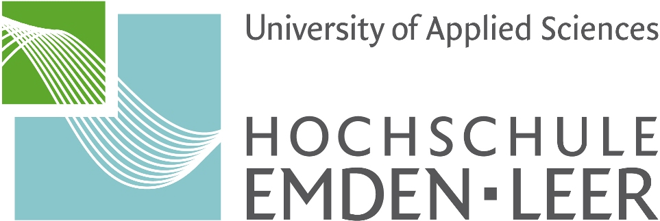

  
  &nbsp;&nbsp;&nbsp;&nbsp;&nbsp;&nbsp;&nbsp;&nbsp;&nbsp;&nbsp;&nbsp;&nbsp;
  

 

# Bachelorarbeit: Fremdfeldbeeinflussung auf Messstromwandler in der Niederspannung

## Projektübersicht

Im Rahmen dieser Bachelorarbeit wird die Messgenauigkeit von Stromwandlern in Niederspannungsschaltanlagen untersucht. Ein besonderer Fokus liegt auf der **magnetischen Kopplung** zwischen benachbarten Phasen bzw. externen Stromschienen. Diese Fremdfelder wurden in Voruntersuchungen als signifikante Störgröße identifiziert, die zu relevanten Messabweichungen führen.

## Autor

**Oliver Schmidt**
Student Elektrotechnik

## Lizenz & Rechtliche Hinweise

Dieses Projekt, einschließlich aller Daten, Quellcodes und Dokumentationen, ist urheberrechtlich geschützt und enthält vertrauliche Informationen des Kooperationspartners.

**Copyright © 2025 Oliver Schmidt & Rolf Janssen GmbH Elektrotechnische Werke**

* Alle Rechte vorbehalten.
* Jede Art der Vervielfältigung, Verbreitung, Veröffentlichung oder Weitergabe an Dritte ist ohne ausdrückliche schriftliche Genehmigung der Rechteinhaber streng untersagt.